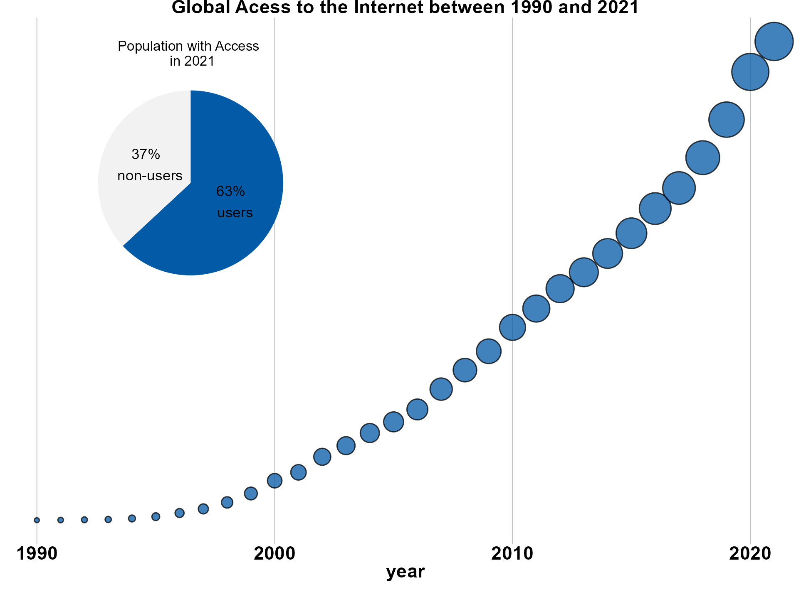
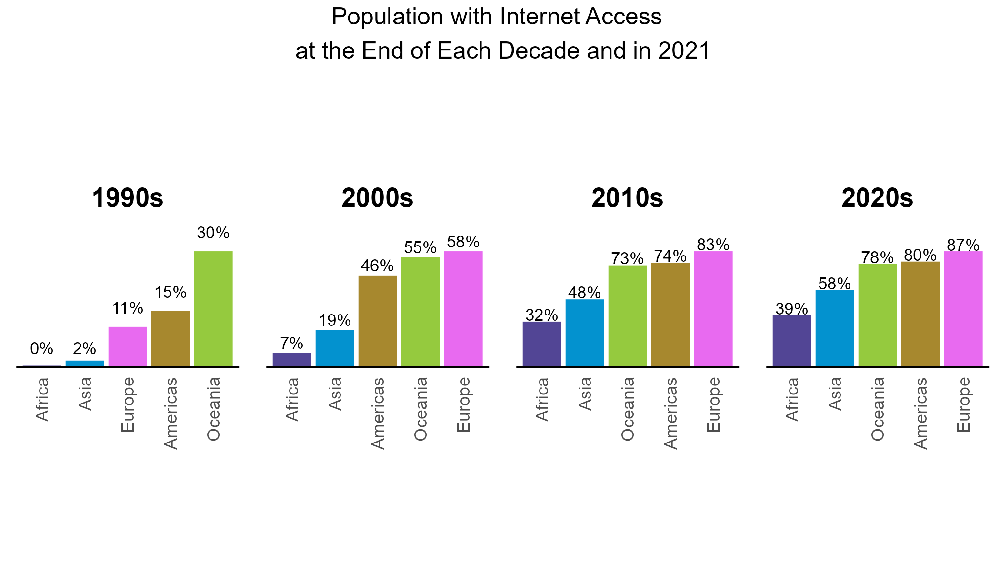
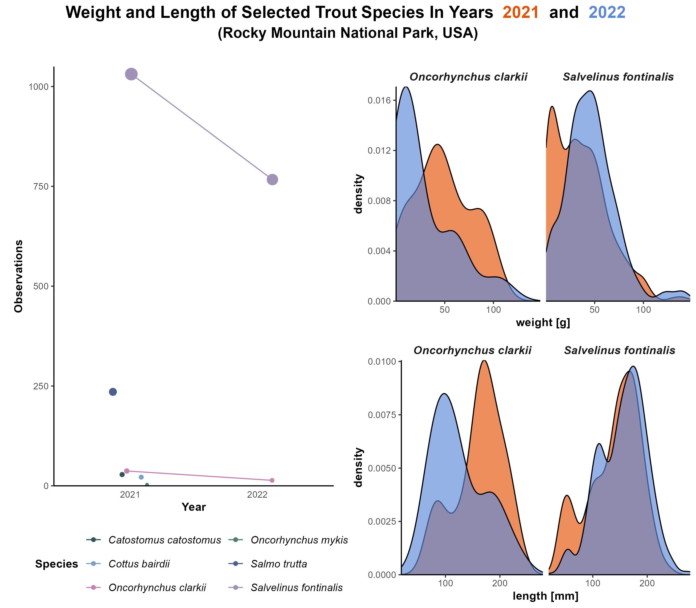
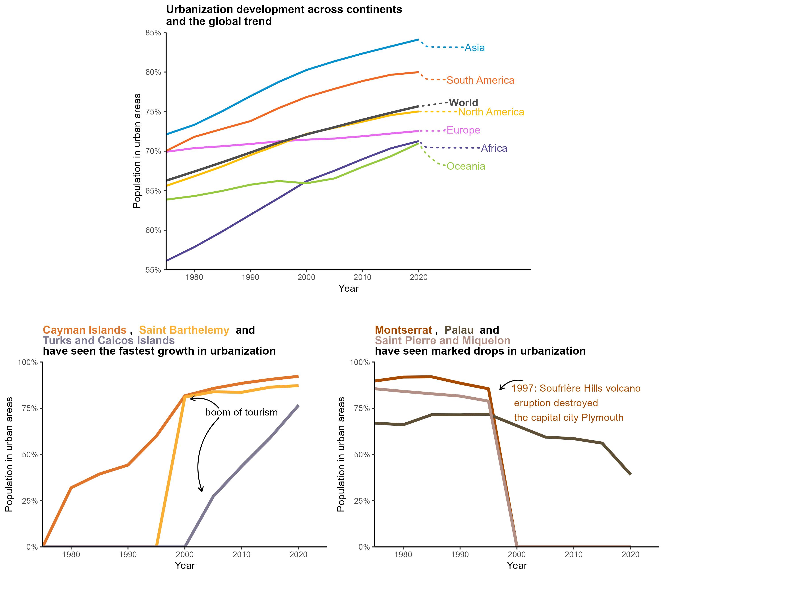

::: {.callout-info}
#30DayChartChallenge

#30DayChartChallenge in April.
:::

```{r}
library(dplyr)
library(tidyr)
library(stringr)
```


# 2026


**Resources**

# 2025

```{r}
#| label: extract-prompts

prompts <- read.delim("../2025/2025-list_prompts.md", header = T, col.names = "prompt")

# clean up markdown styling characters
prompts <- prompts |> 
  mutate(prompt = gsub("  |[\\]|[*]", "", prompt))

# Isolate category amd prompt into separate columns
prompts <- prompts |> 
  mutate(day = as.numeric(gsub(". ", "", str_extract(string = prompt, pattern = "^\\d+. "))),
         category = case_when(
           is.na(day) ~ prompt,
           TRUE ~ NA
         ),
         prompt = gsub("\\d+. ", "", prompt)) |> 
  fill(category, .direction = "down") |> 
  filter_out(is.na(day))
```


```{r}
#| label: identify-prompts-with-plots

plot_files <- list.files("../2025/plots/", pattern = "png", full.names = T)

df_plots <- data.frame(
  "path" = plot_files,
  "day" = as.numeric(str_extract(string = basename(plot_files), pattern = "^\\d+"))
) |> 
  left_join(prompts, by = "day")
```


::: {#2025-gallery layout-ncol=2}

{group="2025-gallery"}

{group="2025-gallery"}

{group="2025-gallery"}

{group="2025-gallery" margin="50px 50px 50px 50px"}

:::

**Resources**